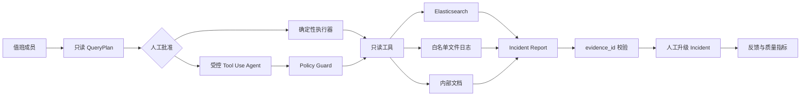

# IoT Ops Agent 项目案例

## 项目定位

IoT Ops Agent 是一个面向 IoT 多服务系统的受控运维诊断产品。值班成员用自然语言描述故障，系统先生成服务、时间窗口、数据源和执行预算明确的只读计划；人工批准后，确定性规则或受控 Tool Use Agent 才能查询脱敏日志，并输出带稳定证据引用的 Incident Report。

仓库保留早期 `sl100_*` 模块名，目的是兼容既有 CLI、MCP 配置和部署脚本。公开材料统一使用匿名 IoT 场景，真实主机、域名、日志和评测语料只存在于 Git 外的私有配置中。

## 业务问题

设备登录、MQTT、WebSocket、OTA、推送和数据库故障通常跨越多个服务。过去的排障方式存在四个问题：

- 测试反馈通常只有现象和大致时间，值班成员需要手工转换成日志查询条件；
- 原始日志可能包含 IP、token、手机号、设备标识，不能直接发送给模型；
- 一次 LLM 对话缺少工具边界、证据约束和失败回退，无法作为生产操作链路；
- 没有冻结案例、用户反馈和运行指标，规则或 prompt 改动后的质量不可衡量。

## 从已有工具到可交付产品

项目没有推倒重写。第一阶段已有日志脱敏、确定性规则、ES/远程文件查询、CLI Tool Use Agent、Go 日志工具、文档检索和 MCP Server。本次交付在这些能力上增加产品控制面：

1. 把“直接执行诊断”拆成 `plan → approve → execute`，旧 API 继续兼容；
2. 增加受控 Agent runtime，限制工具、服务、时间、远程访问、回合、调用次数、时间和 token；
3. 为报告证据生成稳定 `evidence_id`，拒绝模型引用不存在的证据；
4. 增加团队账号、RBAC、CSRF、Redis Session、审计、事件协作、反馈和质量面板；
5. 增加 PostgreSQL 数据迁移、RQ Worker、任务恢复、留存清理、备份、Prometheus/Grafana 和 CI 门禁；
6. 把会过期的真实 ES 案例补成最小化脱敏快照，使评测可以离线回放。

这段演进本身是项目的重要价值：在保留既有投资和兼容性的前提下，把技术原型升级为可治理、可运营、可验证的 Agent 产品。

## 产品工作流

## 核心设计

### 确定性事实是主链路

日志先经过代码处理：读取受限范围、脱敏、识别服务和级别、提取 request/message/device 标识、匹配 incident 类型、生成时间线和证据。规则模式不依赖模型；AI 模式也必须先调用确定性诊断工具。

### Agent 不是无限循环

每个计划保存摘要和 SHA-256 digest。运行时只暴露计划允许的只读工具，并重新约束模型参数：

- 服务不得超出批准链路；
- 时间窗口以计划为准，模型不能扩大；
- `no_remote` 会从工具集合移除远程日志；
- 默认最多 3 回合、6 次工具调用、120 秒；
- 输入、输出和工具结果分别有预算；
- 工具参数、结果、错误和证据引用经脱敏后才持久化。

模型失败、越界调用、超预算、输出非 JSON、脱敏失败或证据引用无效时，系统保留确定性报告并把执行标记为 `fallback`。

### 人工保留最终权限

创建计划不会读取日志；规则和 AI 模式都需要发起人或管理员批准。AI 模式还要求单次显式同意。诊断结果不会自动修改生产配置或创建事件，必须由值班成员人工升级为 Incident。

### 兼容与数据演进

旧 `/api/diagnoses` 保持创建后执行规则诊断；新版 `/api/v1/diagnoses` 返回 `planned` 任务。Alembic 增量迁移为旧任务表增加计划、执行模式、模型、token、耗时等字段，并新增工具轨迹和诊断反馈表。

## 工程化能力

- FastAPI 团队工作台，管理员、值班、只读三种角色；
- Argon2id 密码、本地邀请、一次性重置链接、登录锁定、CSRF；
- Redis 服务端 Session、提交限流、并发诊断限制；
- PostgreSQL 持久化、RQ 后台任务、幂等入队和 stuck job reconciler；
- 事件状态机、负责人、评论、可选通知、完整审计；
- 报告 90 天、工具轨迹 30 天、审计 365 天的留存策略；
- Caddy HTTPS、PostgreSQL 备份与恢复脚本；
- Prometheus 聚合指标和只绑定本机的 Grafana 看板；
- CI 中的 lint、覆盖率、合成评测、依赖漏洞、Go 测试、迁移、Compose 和镜像构建。

## 质量证据

本次本地交付验证结果：

| 验证项 | 结果 |
| --- | --- |
| Python 测试 | 70 passed，1 skipped；PostgreSQL/Redis 启动后该集成测试单独通过 |
| 核心分支覆盖率 | 85.39%，门禁 80% |
| 合成日志评测 | 15/15，57/57；包含正常关闭、debug 断开、孤立上下线、成功推送等负例 |
| 产品行为评测 | 5/5，23/23 |
| 文档检索评测 | 4/4，16/16 |
| MCP / Go | smoke test 与 `go test ./...` 通过 |
| 供应链 | `pip-audit` 无已知漏洞 |
| 部署 | PostgreSQL 从零迁移到 `20260716_0002`，生产镜像构建成功 |
| UI | 桌面端、390px 移动端、审批弹窗、质量面板实测，浏览器控制台零错误 |

私有真实回放包含 43 条人工标注案例，其中 39 条故障、4 条正常。当前证据命中率 72%，类型 precision 100%、recall 78%，正常行为高风险误报为 0。它仍未达到“正常样本至少 8、证据命中率至少 90%、recall 至少 85%”的上线门槛。

这是刻意保留的真实结论：历史 ES 文档已经过期且部分没有快照，正常样本数量也不足。工程代码已具备交付形态，但生产质量结论必须在补采数据后重新验证，不能用合成样本替代。

## 技术取舍

| 取舍 | 决策 | 原因 |
| --- | --- | --- |
| 重写旧系统 | 不采用 | 旧规则、CLI、MCP 和数据接入已有价值，增量演进更符合真实工程 |
| 原始日志直接给 LLM | 不采用 | 隐私、成本、噪声和不可复现风险高 |
| LLM 自由选择范围 | 不采用 | 查询计划和参数策略必须是权威边界 |
| AI 失败即任务失败 | 不采用 | 确定性诊断可作为降级结果 |
| 自动执行生产修复 | 不提供 | 当前阶段风险收益不成立，人工拥有最终权限 |
| 只报告合成准确率 | 不采用 | 同时公开真实 holdout 的失败门槛，避免 demo 指标冒充生产质量 |

## 可用于职业经历的准确表述

可以把它描述为“从既有日志诊断工具演进出的受控 IoT Ops Agent 产品”，强调自己完成了 Agent policy、证据约束、团队协作、质量评测、可观测性和部署链路。不要声称已经自动修复生产故障，也不要声称真实评测已经通过全部上线门槛。

这个项目可以证明的能力包括：Agent 与传统后端结合、增量架构演进、安全和权限设计、离线评测、可靠性工程、可观测性、前后端产品交付，以及面对不完整真实数据时保持指标诚实。
