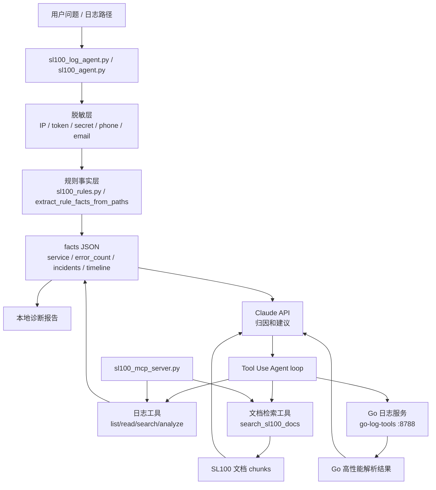

# SL100 运维诊断 Agent 项目说明

## 项目定位

SL100 运维诊断 Agent 是一个面向 IoT 后端服务的本地诊断工具。它从脱敏日志入手，结合规则分析、Claude Tool Use、Go 工具服务、文档检索和 MCP Server，辅助排查设备登录、MQTT 连接、WebSocket 推送、OTA、推送队列和数据库连接等问题。

这个项目的重点不是做一个聊天机器人，而是把真实业务排障流程拆成可验证、可复用、可接入 AI 客户端的工具链。

## 真实问题

SL100 是多服务 IoT 架构，设备链路涉及：

- `gateway`：App/设备 HTTP 入口，设备登录、绑定、用户和设备接口。
- `deviceShadow`：MQTT、设备影子、设备上下线、WebSocket 推送。
- `pushService`：Redis 队列消费，App 推送。
- `AdminService`、`cloudStorage` 等辅助服务。

排查线上或本地问题时，经常需要同时看日志、服务职责、MQTT/WebSocket 文档和历史经验。直接把原始日志丢给 LLM 有三个问题：

- 日志可能包含敏感字段，必须先脱敏。
- 原始日志 token 成本高，且 LLM 容易被噪声带偏。
- 没有 eval 时，很难知道规则或 prompt 改动是否造成误报。

## 架构



## 关键设计

### 1. 先规则，后 AI

日志先经过确定性代码处理：

- 读取指定日志尾部。
- 脱敏敏感字段。
- 识别服务名。
- 统计 error/warning/fatal。
- 提取 request_id、message_id、uuid。
- 匹配 incident 类型。
- 生成 timeline。

Claude 只负责在 facts 基础上做归因、解释和排查建议。

### 2. Golden Set 评测

日志诊断有 10 条 golden cases，覆盖：

- 设备登录失败
- MQTT 连接失败
- MQTT payload 格式错误
- 设备上下线异常
- RPC 调用失败
- 推送失败
- OTA 推送失败
- WebSocket 推送失败
- 配置初始化失败
- 数据库连接失败

评测不仅检查应该命中的 incident，也检查误报：

```text
SL100 log eval: 10/10 cases, 41/41 checks
```

文档检索有 4 条 retrieval cases：

```text
SL100 docs eval: 4/4 cases, 16/16 checks
```

### 3. Go 工具服务

Go 侧实现 `go-log-tools`：

- CLI 模式：直接分析单个日志文件。
- HTTP 模式：暴露 `/analyze` 给 Python Agent 调用。
- 单元测试：覆盖设备登录失败、脱敏和误报控制。

Python 负责编排 Agent，Go 负责稳定、快速、可复用的工具能力。

### 4. RAG 文档问答

文档检索不直接引入向量库，而是先做轻量版本：

- Markdown chunk。
- source/title/score 返回。
- 领域关键词增强。
- retrieval eval 验证检索质量。

这个阶段的重点是理解 RAG 数据流，而不是过早引入复杂基础设施。

### 5. MCP Server

MCP Server 暴露本地工具：

- `analyze_logs`
- `search_sl100_docs`
- `summarize_incident`
- `find_service_errors`

这样 Claude Desktop / Claude Code 等 MCP 客户端可以直接调用本地诊断能力。

## 安全策略

- 不提交真实 SL100 日志。
- 不提交 API key、token、secret、手机号、邮箱、设备 SN、真实公网 IP。
- 样例日志使用 synthetic 或脱敏内容。
- `.gitignore` 忽略 eval 输出、facts 输出、trace 输出。
- 默认先分析本地日志，不直接连接线上服务器。

## 工程取舍

| 方案 | 选择 | 原因 |
| --- | --- | --- |
| 直接把原始日志给 LLM | 不采用 | 成本高、风险高、不可控 |
| 规则事实 + LLM 解释 | 采用 | 可测、可控、便于定位误报 |
| 一开始上向量库 | 不采用 | 当前文档规模小，轻量检索更适合学习和调试 |
| Go 替代全部 Python | 不采用 | Python 更适合 Agent 编排，Go 适合高性能工具 |
| 先做前端 UI | 不采用 | CLI 更适合早期验证诊断链路 |

## 可展示结果

当前项目已经具备：

- 本地日志诊断 CLI。
- 规则 facts 输出。
- Golden log evals。
- Claude Tool Use Agent。
- Go 日志分析服务。
- 轻量 RAG 文档问答。
- MCP Server。
- 求职 Demo 和面试讲稿。
